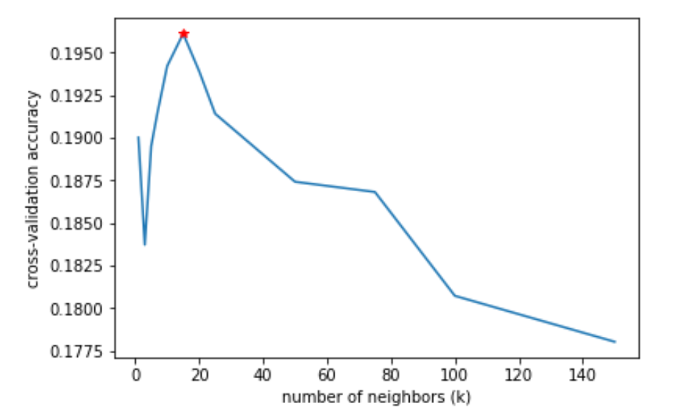

# CIFAR100-KNN-Classifier
This is a k nearest neighbor (k-NN) classifier that can recognize the 20 different super classes in the CIFAR-100 dataset.

## Dataset 
* You can download the dataset from http://www.cs.toronto.edu/~kriz/cifar.html 
* The CIFAR-100 dataset consists of 60000 32x32 colour images in 100 classes (and 20 superclasses), with 600 images per class. There are 50000 training images and 10000 test images.

## Design

The classifier was built using L2 for distance calculation and using the following Ks: 1, 3, 5, 7, 10, 15, 20, 50,75,100,125,150

## Training Accuracy for different Ks to find the best 'K'

#### The accuracies of each fold (3 cross-fold validation) and their average accuracy was as follows:

~~~
660 / 3333 correct =\> accuracy: 0.198020
Got 601 / 3333 correct =\> accuracy: 0.180318
Got 639 / 3333 correct =\> accuracy: 0.191719

!!Average accuracy for k = 1 : 0.190019

Got 654 / 3333 correct =\> accuracy: 0.196220
Got 573 / 3333 correct =\> accuracy: 0.171917
Got 610 / 3333 correct =\> accuracy: 0.183018

!!Average accuracy for k = 3 : 0.183718

Got 647 / 3333 correct =\> accuracy: 0.194119
Got 632 / 3333 correct =\> accuracy: 0.189619
Got 616 / 3333 correct =\> accuracy: 0.184818

!!Average accuracy for k = 5 : 0.189519

Got 663 / 3333 correct =\> accuracy: 0.198920
Got 632 / 3333 correct =\> accuracy: 0.189619
Got 620 / 3333 correct =\> accuracy: 0.186019

!!Average accuracy for k = 7 : 0.191519

Got 673 / 3333 correct =\> accuracy: 0.201920
Got 631 / 3333 correct =\> accuracy: 0.189319
Got 638 / 3333 correct =\> accuracy: 0.191419

!!Average accuracy for k = 10 : 0.194219

Got 656 / 3333 correct =\> accuracy: 0.196820
Got 655 / 3333 correct =\> accuracy: 0.196520
Got 650 / 3333 correct =\> accuracy: 0.195020

!!Average accuracy for k = 15 : 0.196120

Got 646 / 3333 correct =\> accuracy: 0.193819
Got 646 / 3333 correct =\> accuracy: 0.193819
Got 647 / 3333 correct =\> accuracy: 0.194119

!!Average accuracy for k = 20 : 0.193919

Got 630 / 3333 correct =\> accuracy: 0.189019
Got 637 / 3333 correct =\> accuracy: 0.191119
Got 647 / 3333 correct =\> accuracy: 0.194119

!!Average accuracy for k = 25 : 0.191419

Got 627 / 3333 correct =\> accuracy: 0.188119
Got 616 / 3333 correct =\> accuracy: 0.184818
Got 631 / 3333 correct =\> accuracy: 0.189319

!!Average accuracy for k = 50 : 0.187419

Got 634 / 3333 correct =\> accuracy: 0.190219
Got 598 / 3333 correct =\> accuracy: 0.179418
Got 636 / 3333 correct =\> accuracy: 0.190819

!!Average accuracy for k = 75 : 0.186819

Got 605 / 3333 correct =\> accuracy: 0.181518
Got 593 / 3333 correct =\> accuracy: 0.177918
Got 609 / 3333 correct =\> accuracy: 0.182718

!!Average accuracy for k = 100 : 0.180718

Got 587 / 3333 correct =\> accuracy: 0.176118
Got 602 / 3333 correct =\> accuracy: 0.180618
Got 591 / 3333 correct =\> accuracy: 0.177318

!!Average accuracy for k = 150 : 0.178018

~~~

### Accordingly, the best-chosen **k = 15**

## Testing

**For the testing part,** ACCR and CCRn turned out to be the following:

~~~

Got 1998 / 10000 correct =\> accuracy: 0.199800

~~~

~~~
ACCR for best chosen k = 15 : 0.199800

CCRn per per class:

0 0.23000000000000004
1 0.326
2 0.244
3 0.34
4 0.264
5 0.092
6 0.144
7 0.214
8 0.07400000000000001
9 0.17400000000000002
10 0.668
11 0.10200000000000001
12 0.162
13 0.244
14 0.016
15 0.068
16 0.106
17 0.412
18 0.016
19 0.1
~~~

